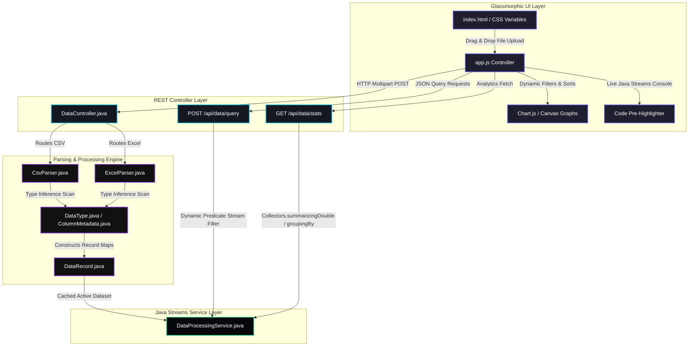

# Streamlytics - High-Performance CSV & Excel Data Processor

Streamlytics is a dynamic, schema-agnostic, memory-efficient data processing web application. It combines a robust **Spring Boot (Java 23)** backend using Gradle with a premium, responsive **Glassmorphic Single-Page Application (SPA)** front-end. 

Instead of hardcoding the system for a specific database structure, Streamlytics is designed to process *any* user-uploaded CSV or Excel file, automatically inferring data schemas and executing high-performance **Java Streams** operations (filtering, sorting, pagination, and statistical aggregations) in real-time.

---

## 1. Problem Statement & Challenges

Traditional data upload and processing modules in enterprise applications suffer from three primary bottlenecks:

1. **Memory Inefficiency (OutOfMemory Errors):** Loading large CSV or Excel files (hundreds of thousands of records) fully into memory before processing causes significant JVM garbage collection overhead and easily triggers `java.lang.lang.OutOfMemoryError` in web containers.
2. **Rigid Schema Hardcoding:** Typical data processors require developers to write custom Java classes (POJOs) for *every* unique file format. If a column header is modified, added, or removed, the backend code has to be refactored, recompiled, and redeployed.
3. **Complex Query Mechanics:** Implementing flexible data analysis (multi-column grouping, custom sorting of dates/numbers, mathematical summaries) usually involves complex SQL database schemas or heavyweight ORMs.
4. **Poor Visual Feedback:** Users uploading datasets are rarely given clear, actionable insight into the analytical breakdowns of their data, and developers/students are left in the dark regarding what exact code executes behind visual UI filters.

---

## 2. The Ideation & Solution

Streamlytics resolves these challenges through a unified design philosophy:

* **Dynamic In-Memory Streaming:** Parse files sequentially using high-performance stream buffers (`BufferedReader` + `commons-csv`), and load them into a fast, temporary in-memory repository to guarantee sub-millisecond query responses without database bloat.
* **Schema & Type Inference Engine:** Evaluate column headers dynamically, and run statistical scans over the initial records of any uploaded file to automatically infer schemas and data types (`NUMERIC`, `BOOLEAN`, `DATE`, or `STRING`). Once inferred, cells are cast to native Java equivalents (`Double`, `Boolean`, `LocalDate`, `String`) for high-fidelity comparison and calculation.
* **Pure Java Streams Querying:** Replace database queries with raw, native Java 23 Stream pipelines. Leverage built-in collectors like `DoubleSummaryStatistics` and categorical map reducers (`groupingBy`) for instant descriptive analytics.
* **The Live Java Streams Console:** To close the bridge between the user interface and backend execution, compile a live, syntax-highlighted Java Streams code block inside the UI that replicates the exact filter, sorting, and pagination logic running on the Spring Boot server.

---

## 3. Architecture & Modular Layers

The application follows a clean, highly modular layered architecture that separates parsing, domain models, business logic, REST APIs, and client-side visualization:



### Module Breakdown:
1. **Core Domain Models (`com.dataprocessor.model`):**
   * [DataType.java](file:///c:/Users/HP/Desktop/New%20folder/Java/Projects/CSV%20Data%20Processor/src/main/java/com/dataprocessor/model/DataType.java): Inferred column type boundaries (`STRING`, `NUMERIC`, `BOOLEAN`, `DATE`).
   * [ColumnMetadata.java](file:///c:/Users/HP/Desktop/New%20folder/Java/Projects/CSV%20Data%20Processor/src/main/java/com/dataprocessor/model/ColumnMetadata.java): Encapsulates column names and inferred types.
   * [DataRecord.java](file:///c:/Users/HP/Desktop/New%20folder/Java/Projects/CSV%20Data%20Processor/src/main/java/com/dataprocessor/model/DataRecord.java): Represents an individual parsed row as a map of column names to typed native Java objects.
   * [DatasetMetadata.java](file:///c:/Users/HP/Desktop/New%20folder/Java/Projects/CSV%20Data%20Processor/src/main/java/com/dataprocessor/model/DatasetMetadata.java): Captures global statistics about the active file (total lines, size in bytes, parse duration).
   * [ProcessingStats.java](file:///c:/Users/HP/Desktop/New%20folder/Java/Projects/CSV%20Data%20Processor/src/main/java/com/dataprocessor/model/ProcessingStats.java): Encapsulates double summaries for numeric fields and distributions for categorical fields.
2. **Parsing Layer (`com.dataprocessor.parser`):**
   * [DataParser.java](file:///c:/Users/HP/Desktop/New%20folder/Java/Projects/CSV%20Data%20Processor/src/main/java/com/dataprocessor/parser/DataParser.java): Global parsing interface defining a unified parse structure.
   * [CsvParser.java](file:///c:/Users/HP/Desktop/New%20folder/Java/Projects/CSV%20Data%20Processor/src/main/java/com/dataprocessor/parser/CsvParser.java): Sequential line-streaming parsing using `BufferedReader` and Apache Commons CSV. Includes type-inference scanning of the initial 500 records.
   * [ExcelParser.java](file:///c:/Users/HP/Desktop/New%20folder/Java/Projects/CSV%20Data%20Processor/src/main/java/com/dataprocessor/parser/ExcelParser.java): Utilizes Apache POI with a dedicated cell formula evaluator and formatting helper.
3. **Data Streams Processing Service (`com.dataprocessor.service`):**
   * [DataProcessingService.java](file:///c:/Users/HP/Desktop/New%20folder/Java/Projects/CSV%20Data%20Processor/src/main/java/com/dataprocessor/service/DataProcessingService.java): The computational heart. Executes in-memory stream filtering, page segmentation (`.skip()`, `.limit()`), and advanced aggregations.
4. **REST API Controller Layer (`com.dataprocessor.controller`):**
   * [DataController.java](file:///c:/Users/HP/Desktop/New%20folder/Java/Projects/CSV%20Data%20Processor/src/main/java/com/dataprocessor/controller/DataController.java): Exposes secure endpoints, maps incoming uploads, and handles error states cleanly.

---

## 4. Key Technology Stack & Frameworks

The application is built on top of high-performance, modern technologies:

* **Java 23 (JDK 23):** Leverages modern language constructs like Java Records for concise, thread-safe metadata representations.
* **Spring Boot 3.4.1:** Provides the embedded Tomcat container, auto-routing multipart uploads, CORS capabilities, and REST controllers.
* **Gradle 9.4.1:** Serves as the native build system for seamless package management and test runs.
* **Apache Commons CSV (v1.11.0):** Provides a robust, standard-compliant, streaming CSV parser with automatic quote/separator escape resolutions.
* **Apache POI & POI-OOXML (v5.2.5):** Industry-standard libraries utilized to evaluate formulas and rows in modern Excel spreadsheet zip structures (`.xlsx` and `.xls`).
* **Chart.js (v4.x):** Utilized on the frontend via safe CDN to render gorgeous, fluidly animated canvas widgets (bar charts, line graphs, pie graphs) representing data statistics dynamically.

---

## 5. Streams Processing Workflow & Implementation

```text
Upload -> Stream Parse -> In-Memory Cache -> Java Streams Pipeline -> UI JSON Output
```

### Dynamic Multi-Rule Filtering
When query filters are added, the client sends a list of filter criteria. The backend translates these into a dynamic Java Stream predicate:
```java
List<DataRecord> filtered = records.stream()
    .filter(record -> matchesFilters(record, request.getFilters(), metadata.columns()))
    .collect(Collectors.toList());
```
Inside the `matchesFilters` method, columns are evaluated based on their inferred types:
* **Numeric:** Supports `EQUALS` (using a epsilon margin `1e-9` for float safety), `GREATER_THAN`, and `LESS_THAN`.
* **Date:** Resolves local date comparisons (using Chronological bounds checking: `isAfter()`, `isBefore()`).
* **Boolean:** Compares logical states.
* **String:** Employs case-insensitive text containment tests (`contains()`, `startsWith()`, `equals()`).

### Fast Descriptive Aggregation
To display analytics dashboards instantly, the service computes multi-pass metrics using optimized standard streams:
```java
// Numerical metrics
DoubleSummaryStatistics stats = records.stream()
    .map(r -> r.getValue(colName))
    .filter(Objects::nonNull)
    .mapToDouble(v -> (Double) v)
    .summaryStatistics(); // Sum, Average, Min, Max, Count in one pass!

// Categorical distributions
Map<String, Long> distribution = records.stream()
    .map(r -> r.getValue(colName))
    .filter(Objects::nonNull)
    .map(Object::toString)
    .collect(Collectors.groupingBy(v -> v, Collectors.counting()));
```

---

## 6. Verification & Automated Test Runs

The application logic has been verified via unit testing inside [DataProcessingServiceTest.java](file:///c:/Users/HP/Desktop/New%20folder/Java/Projects/CSV%20Data%20Processor/src/test/java/com/dataprocessor/service/DataProcessingServiceTest.java) to ensure accuracy across all core processing operations.

To run the automated tests locally:
```bash
./gradlew test
```
This compile-test run successfully completes, validating the comparator chains, grouping collectors, and numerical summary bounds under the Gradle ecosystem.

---

## 7. How to Run and Interact with Streamlytics

### Step 1: Run the Server
Open a terminal in the root directory and start the Spring Boot server:
```bash
./gradlew bootRun
```
*Tomcat will spin up, serving the application assets automatically on `http://localhost:8080`.*

### Step 2: Open the Dashboard
Navigate your web browser to:
```text
http://localhost:8080
```

### Step 3: Test Uploading
A sample CSV data sheet has been generated inside the root directory: **[employees_sample.csv](file:///c:/Users/HP/Desktop/New%20folder/Java/Projects/CSV%20Data%20Processor/employees_sample.csv)**.
1. Drag and drop this file onto the dashboard drop-zone.
2. Filter columns (e.g., `Salary > 65000` or `Department EQUALS Sales`) using the sidebar controls.
3. Click on the headers in the **Parsed Dataset Registry** grid to sort chronologically, alphabetically, or numerically.
4. Open the **Live Java Streams Code Console** at the bottom of the page to copy the compiled Java code used to run that exact pipeline on the server!
